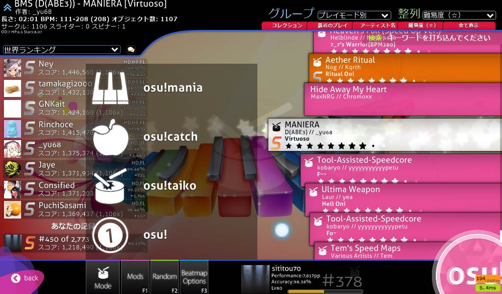
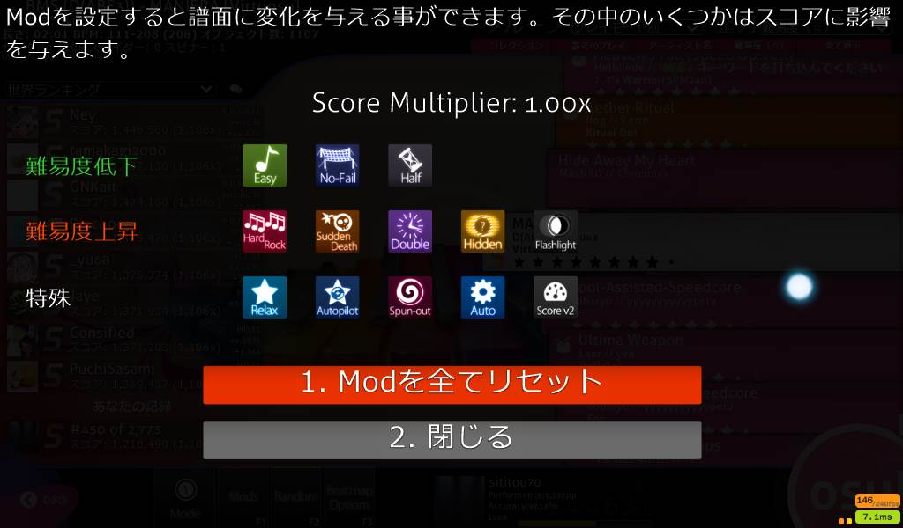

# sititou70 simple osu skin
for **osu!(standard)** and **osu!taiko**

# install
download `sititou70.osk` from [latest release](https://github.com/sititou70/sititou70-osu-skin/releases) and double click

## update
if you already have the old version, you must delete it before install the new version.
delete `[osu directory]/Skins/sititou70` directory.

# thanks
this skin is based on **osu-skin-default** and **shinchikuhome! skin**.

* [osu-skin-default](https://github.com/emersion/osu-skin-default)
* [shinchikuhome's twitter](https://twitter.com/shinchikuhome)

